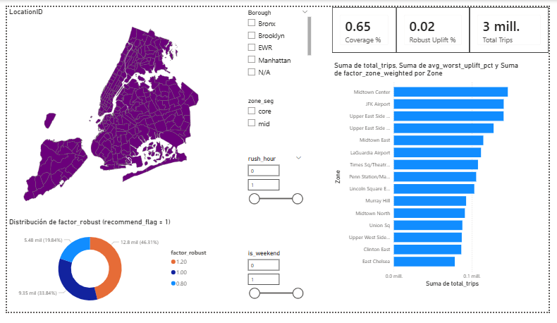

# NYC Yellow Taxi Pricing Optimization — Project Overview

The goal of this project is to build a **pricing optimization framework** for NYC Yellow Taxi trips using **real TLC trip records (Jan–Mar 2023)**.  
We define price as **fare per mile** and generate **robust price recommendations** by **pickup zone × hour**, under uncertainty about demand elasticity.

This repo includes:
- A reproducible data pipeline (cleaning → feature engineering → zone-hour panel)
- A demand baseline model (sparse Poisson GLM)
- A **robust optimization policy** segmented by zone demand and rush-hour
- Power BI dashboard instructions + artifacts for visualization

---

## Dataset Structure

**Source:** NYC Taxi & Limousine Commission (TLC) Trip Record Data (Yellow Taxi) [2](https://www.nyc.gov/site/tlc/about/tlc-trip-record-data.page)  
The project uses three monthly parquet files:
- `yellow_tripdata_2023-01.parquet`
- `yellow_tripdata_2023-02.parquet`
- `yellow_tripdata_2023-03.parquet`

**Core engineered tables:**
1) `taxi_trips_cleaned_v2` (trip-level cleaned data)
2) `hourly_zone_panel` (panel at **pickup_hour × PULocationID**)
3) Pricing artifacts (policy outputs):
   - `pricing_policy_granular.csv`
   - `pricing_policy_zone_agg.csv`
   - `pricing_policy_segments.csv`
   - `pricing_policy_sim_segment.csv`

**Taxi Zone metadata:**
- Taxi Zone Lookup Table (LocationID → Borough, Zone, service_zone) [3](https://data.cityofnewyork.us/Transportation/Taxis-in-NYC/tvge-c4vh)  
- Taxi zone polygons (shapefile) for mapping [3](https://data.cityofnewyork.us/Transportation/Taxis-in-NYC/tvge-c4vh)  

---

## Methodology (High-Level)

### 1) Price Definition
We define a comparable “price” signal as:

**fare_per_mile = fare_amount / trip_distance**

Then we apply guardrails to avoid division blowups and extreme outliers:
- minimum distance threshold
- percentile clipping on fare_per_mile

### 2) Demand Panel (Zone × Hour)
We aggregate trips into a panel keyed by:
- `pickup_hour` (timestamp floored to hour)
- `PULocationID` (pickup taxi zone)

Features include:
- `trips` (hourly demand)
- average trip composition (distance, duration, speed proxy)
- time controls (hour, day_of_week, rush_hour, weekend)
- payment mix (if available)

### 3) Demand Baseline Model (Predictive)
We train a sparse Poisson GLM-style model using:
- categorical `zone_hour = PULocationID × hour` (sparse one-hot)
- log-transformed trip composition controls
- day-of-week effects

This provides stable, realistic demand predictions on March holdout.

### 4) Pricing Optimization (Robust, Segmented)
Observed “price” is not fully exogenous in taxi markets, so instead of relying on a single estimated elasticity, we optimize under **scenario uncertainty**.

We segment zones by historical demand volume:
- `core` (top N zones)
- `mid`
- `outer`

And we further segment by:
- `rush_hour` vs `non-rush`

Within each segment, we define plausible elasticity scenarios and compute a **maximin (worst-case) optimal factor** over:
- `factor ∈ [0.8, 1.2]` (±20%)

Outputs:
- granular policy (zone-hour)
- aggregated zone policy (operable)
- segment table (assumptions + chosen robust factors)
- scenario multiplier curves (for explainability)

---

## Insights Summary

Key policy behavior (validated via sanity checks):
- **Non-rush hours** predominantly recommend **price increases** (factor 1.2).
- **Rush hours** predominantly recommend **price decreases** (factor 0.8).
- Mid-demand zones often remain neutral (factor 1.0) under robust assumptions.

Overall result:
- **Robust worst-case uplift (March): ~2.29%** (policy vs baseline on recommended cells)

---

## Recommendations

**Core zones:**
- Increase fare_per_mile during non-rush hours (demand less elastic)
- Decrease fare_per_mile during rush hours (demand more elastic)

**Mid zones:**
- Maintain baseline pricing under uncertainty (robust optimum ~ neutral)

**Outer zones:**
- No recommendation by default (insufficient confidence / low volume)

---

## Dashboard (Power BI)

A 4-page Power BI report is built from the exported CSV artifacts:
1) Executive Summary (coverage, robust uplift, top zones)
2) Zone Map & Zone Policy (with taxi zone shapes)
3) Hourly Operations (heatmaps, patterns by rush/non-rush)
4) Methodology & Robustness (segment assumptions, scenario curves)

Taxi zone lookup and shapefile are available from TLC-linked resources. [3](https://data.cityofnewyork.us/Transportation/Taxis-in-NYC/tvge-c4vh), [2](https://www.nyc.gov/site/tlc/about/tlc-trip-record-data.page)  

---

## How to Run

1) Place the TLC parquet files in the project root:
   - `yellow_tripdata_2023-01.parquet`
   - `yellow_tripdata_2023-02.parquet`
   - `yellow_tripdata_2023-03.parquet`

2) Run the pipeline scripts in order:
   - `01_build_clean_db_v2.py`
   - `02_build_hourly_zone_panel.py`
   - `03d_sparse_poisson_zonehour.py`
   - `04_optimize_pricing_policy_segmented.py`

---

## Limitations & Next Steps
- Observed price is partially endogenous (traffic, composition, market conditions).
- No direct A/B test or causal identification in this offline study.
- Next steps:
  - incorporate weather/events proxies
  - capacity constraints / wait time proxy
  - zone-level elasticity learning with shrinkage
  - simulation backtesting over multiple months

